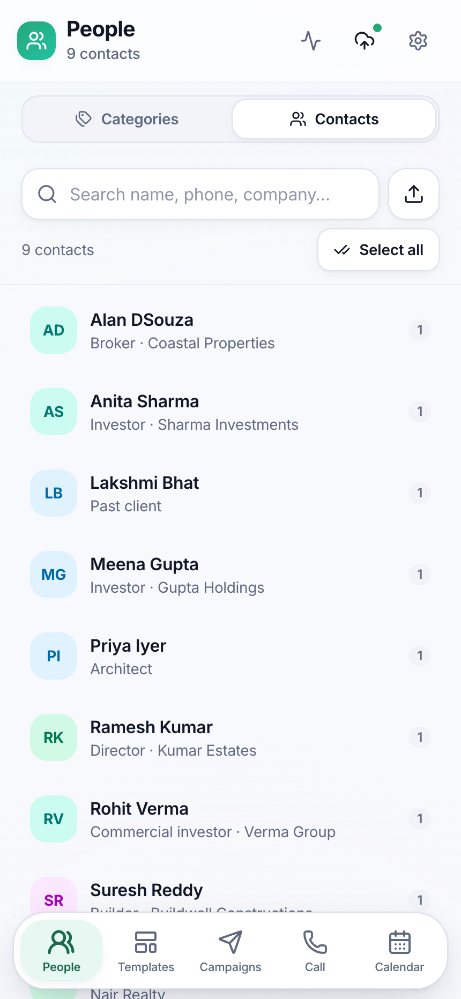
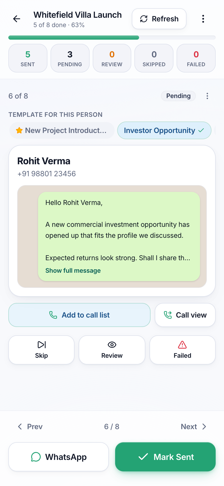
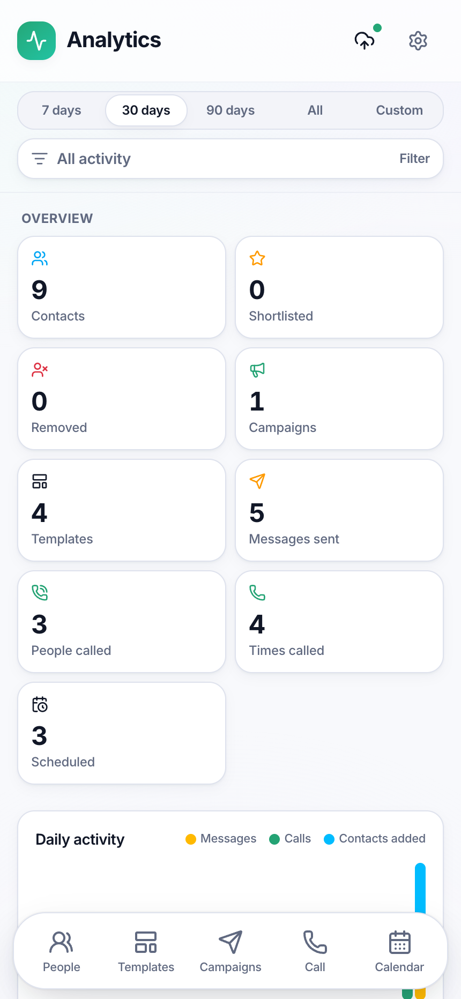
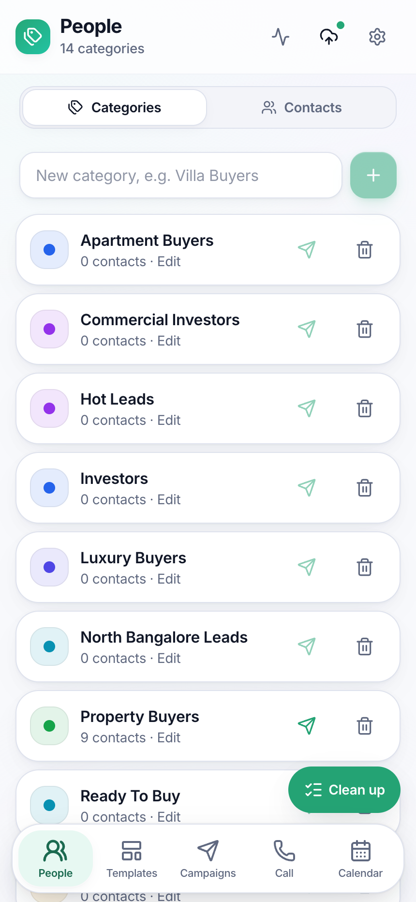
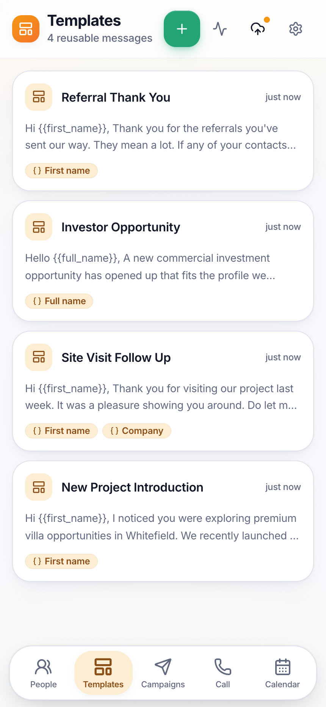
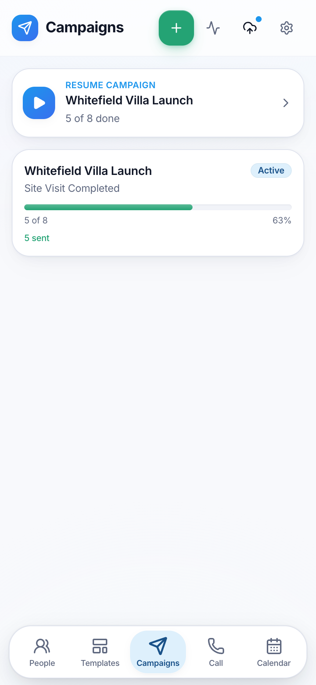
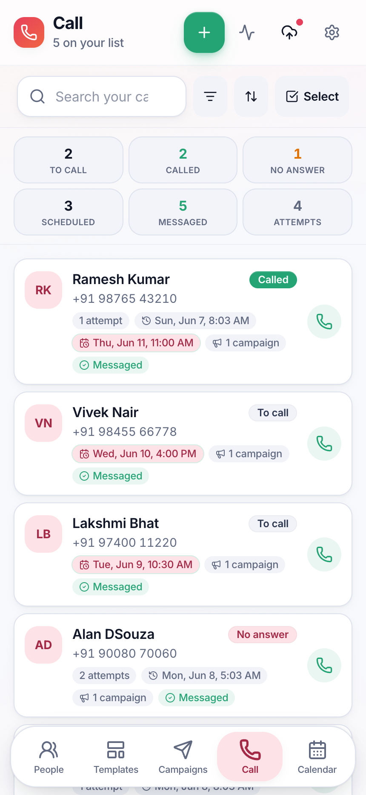
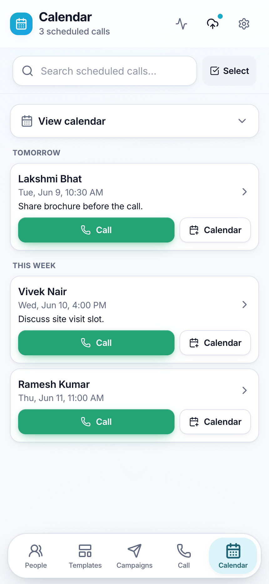
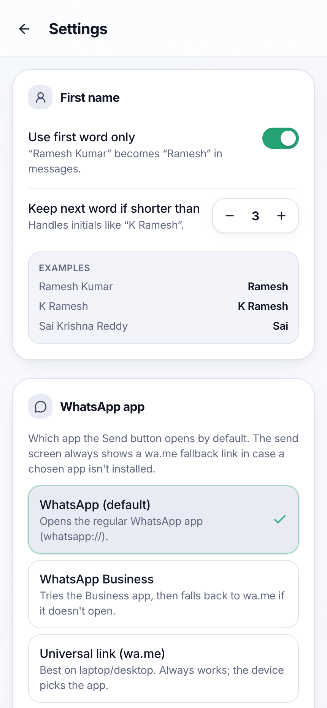
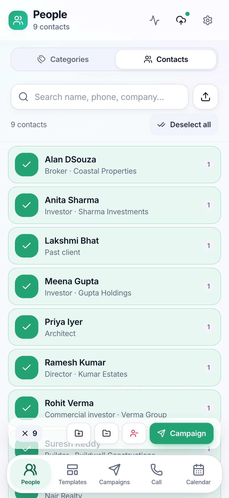

<div align="center">

# WhatsApp Message Manager

### Personalized WhatsApp outreach at scale — for free, from your own number, with your data staying on your device.

**No servers · No WhatsApp Business API · No per-message fees · No spam**

[](https://nextjs.org/)
[](https://react.dev/)
[](https://www.typescriptlang.org/)
[](https://tailwindcss.com/)
[](#install-it-as-an-app-pwa)
[](#why-zero-cost)

&nbsp;
&nbsp;


</div>

---

## What is this?

**WhatsApp Message Manager** is a mobile-first web app that helps you run **personalized one-to-one WhatsApp outreach** to hundreds of people without paying for anything and without ever leaving your own WhatsApp account.

You bring in your contacts, organize them into groups, write reusable message templates with `{{first_name}}`-style placeholders, and the app turns them into a clean **send queue**: one tap opens WhatsApp with the message already typed for that person — *you* press send. Every message is reviewed and sent by a human, so there's no automation, no bulk-blasting, and nothing that gets your number flagged.

It was originally built for real-estate follow-ups, but it works for **anyone who does repetitive, personal WhatsApp messaging**:

- 🏠 **Real estate** — buyer follow-ups, site-visit reminders, investor updates
- 💼 **Sales & freelancers** — lead nurturing, quote follow-ups, renewals
- 🧑‍💼 **Recruiters** — candidate outreach and interview coordination
- 🎓 **Coaches, tutors & clinics** — batch reminders and re-engagement
- 🎉 **Event hosts & communities** — invitations, RSVPs, announcements
- 🛍️ **Small businesses** — order updates, offers, and re-orders to known customers

> [!IMPORTANT]
> This is **not** a bulk/auto-sender and it does **not** use the WhatsApp Business API. It prepares messages; you tap send. That is exactly what keeps it free, personal, and within the spirit of WhatsApp's terms.

---

## Why zero cost?

Most "WhatsApp marketing" tools charge a subscription **and** a per-message fee because they route messages through the paid **WhatsApp Business API** (via a Business Solution Provider). This app does neither.

| | Typical WhatsApp marketing tool | WhatsApp Message Manager |
| --- | --- | --- |
| Monthly subscription | ✅ Required | ❌ None |
| Per-message / per-conversation fee | ✅ Charged | ❌ None |
| WhatsApp Business API account | ✅ Required | ❌ Not used |
| Where messages send from | A shared/business number | **Your own WhatsApp**, your own number |
| Where your contact data lives | Their cloud servers | **Only your device** |
| Sending model | Automated bulk blast | Human-reviewed, one tap per send |

Instead of an API, it builds standard **WhatsApp deep links** (`https://wa.me/...` or the native `whatsapp://` scheme) with the message pre-filled. Opening one launches your installed WhatsApp with everything ready to go. The only thing left is for you to hit send.

**The result:** unlimited contacts, unlimited templates, unlimited campaigns — `$0`.

---

## Highlights

- **📇 Import contacts from your phone** — export a `.vcf` from your phone's Contacts app and bring them in. Re-import any time: new contacts are **added**, existing ones are **updated**, and nothing is ever **duplicated** (matched by phone number).
- **🗂️ Organize into groups** — tag contacts into any number of categories (Buyers, Hot Leads, VIPs, Batch A…) and target campaigns at them.
- **✍️ Reusable templates** — write once with `{{first_name}}`, `{{company}}` and more; preview before you use it.
- **🚀 Campaigns & send queue** — generate a personalized message per contact, then fly through them one tap at a time. Attach multiple templates and pick the right one per person.
- **📞 Call list & follow-ups** — log call outcomes, keep notes, and schedule the next call.
- **📅 Calendar reminders** — add a scheduled call to your phone's real calendar with a one-tap `.ics` event.
- **📊 Analytics** — see messages sent, calls made and contacts added over time.
- **🔒 100% private & offline-first** — everything lives in your browser. No account, no sign-up, no server.
- **📱 Installable PWA** — add it to your home screen and use it like a native app.

---

## Screenshots

<sub>Captured on an iPhone 14 Pro Max with demo data.</sub>

| People & groups | Templates | Campaigns |
| :---: | :---: | :---: |
|  |  |  |
| **Send queue** | **Call list** | **Calendar** |
|  |  |  |
| **Analytics** | **Settings** | **Bulk select** |
|  |  |  |

---

## Getting started

```bash
npm install
npm run dev      # open http://localhost:3000
```

On first launch, open the **People** tab → **Contacts** and tap **Load demo data** to instantly seed example contacts, groups and templates so you can explore every screen. When you're ready for real data, clear it from **Settings** and import your own `.vcf`.

### Install it as an app (PWA)

For the best experience, open the app in your phone's browser and **Add to Home Screen**. It then runs full-screen, works offline, and respects the iPhone's safe-area insets — just like a native app.

---

## How to use it

### 1. Bring in your contacts

Head to **People → Contacts**. You'll see everyone you've imported.

To add contacts, you first export them from your phone as a `.vcf` (vCard) file, then import that file here:

**On iPhone** → Contacts app → select contacts (or a group) → **Share Contact** / **Export vCard** → save the `.vcf`.
**On Android** → Contacts app → **Settings → Export → .vcf**.
**From Google Contacts** → [contacts.google.com](https://contacts.google.com) → **Export → vCard**.

Then in the app: tap the **Import** (⬆️) button, choose your `.vcf` file(s), review the preview, and confirm.

> [!TIP]
> **Re-import as often as you like.** The app keys every contact by its phone number, so importing again will:
> - **Add** any genuinely new people,
> - **Enrich/Update** existing contacts with any new details (email, company, etc.),
> - **Merge** duplicates that share a number,
> - and **never re-add** anyone you previously removed.
>
> So your monthly "export everything from my phone and import it again" habit just keeps the app fresh — no duplicates, no manual cleanup.

Multiple `.vcf` files at once are supported, and the import preview tells you exactly how many were added, updated, merged or skipped before you commit.

### 2. Organize into groups

Switch to the **Categories** tab inside **People**. Create groups like *Hot Leads*, *Investors*, *Batch A* — give them a colour and edit them any time. Select contacts (tap to multi-select, or **Select all**) and use the floating action bar to **add to** or **remove from** a group in bulk.

### 3. Write templates

Open **Templates** and create a reusable message. Drop in placeholders that get filled per person:

```
Hi {{first_name}},

Thanks for your interest in {{company}}. I'd love to share a few options
that match what you're looking for — when works for a quick chat?
```

Available variables: `{{first_name}}`, `{{last_name}}`, `{{full_name}}`, `{{phone}}`, `{{email}}`, `{{company}}`, `{{designation}}`. A live preview shows exactly how it'll read.

### 4. Run a campaign

From a group (or any ad-hoc selection of contacts), create a **Campaign**. Pick one or more templates, and the app generates a **frozen, personalized message for every contact**. (Frozen means later edits to a template never alter a campaign that's already running.)

### 5. Send — one tap at a time

Open the campaign's **send queue**. For each person you'll see their personalized message and a big **WhatsApp** button:

1. Tap **WhatsApp** → your WhatsApp opens with the message pre-typed.
2. Review it, press send in WhatsApp.
3. Come back and tap **Mark Sent** (or **Skip** / **Review** / **Failed**).
4. On to the next person.

A progress bar tracks how far you are, and you can pause and **resume** any time. If someone has multiple templates attached, switch which one to use for *this* person right in the queue.

### 6. Follow up by call & calendar

Add contacts to the **Call** list to work the phone instead of chat. Log each outcome (*Called*, *No answer*, *Skipped*), jot notes, and **schedule the next call**. Scheduled calls appear under **Calendar**, and a one-tap **Add to calendar** drops a real event into your phone's calendar via a standard `.ics` file — no calendar permissions or sign-in required.

### 7. Track your activity

The **Analytics** dashboard shows messages sent, people called and contacts added over the last 7 / 30 / 90 days (or a custom range), with a daily activity chart so you can see your outreach rhythm.

---

## Settings worth knowing

- **First-name personalization** — controls how `{{first_name}}` is trimmed from a full name (e.g. *"Ramesh Kumar" → "Ramesh"*), with smart handling of initials like *"K Ramesh"*.
- **WhatsApp app** — choose whether send links open **WhatsApp**, **WhatsApp Business**, or the universal **wa.me** link (best on laptop/desktop). It automatically falls back to `wa.me` if a chosen app isn't installed.
- **Removed contacts** — anyone you remove is hidden everywhere and skipped on future imports (a personal block-list). Restore them here any time.
- **Backup & restore** — export your *entire* app state to a single JSON file and restore it on another device (**Merge** or **Replace**). Because there's no server, this is how you move or safeguard your data.
- **Shortlist export** — export just your curated shortlist as a re-importable JSON backup or a plain **CSV** for spreadsheets.

> [!NOTE]
> Every destructive or bulk action (deleting, removing, bulk group changes, restoring, resetting a campaign) asks for confirmation first. Nothing irreversible happens by surprise.

---

## Your data & privacy

- **It never leaves your device.** All contacts, templates, campaigns and notes are stored locally in your browser via **IndexedDB**. There is no backend, no account, and nothing is uploaded.
- **You send from your own number** through your own WhatsApp — the app only prepares the message.
- **Backups are yours** — the only copies that exist anywhere else are the backup files *you* choose to export.
- The app makes no network calls to operate, beyond loading itself and the WhatsApp links you tap. *(If you deploy it to Vercel, Vercel's optional anonymous web-analytics is included — remove `@vercel/analytics` if you'd rather have zero external calls.)*

---

## Tech stack

- **Next.js 16** (App Router, Turbopack) · **React 19** · **TypeScript** (strict)
- **Tailwind CSS v4** + a small local UI kit · **Inter** font · light theme · installable **PWA**
- **Dexie.js** over **IndexedDB** for persistence · `useLiveQuery` for reactive UI
- **Zustand** for transient UI state · **libphonenumber-js** for phone normalization
- **lucide-react** icons · **Vitest** + React Testing Library for tests

### Architecture

The app is **fully client-side** — there is no server data layer. It's organized by feature, with thin components over small, pure, well-tested logic. Persistence flows through per-feature repositories that wrap Dexie.

```
src/
  app/                  # Routes (App Router). (main)/* share the bottom nav.
  components/           # Shared UI kit + layout (header, bottom nav)
  features/
    contacts/           # Import (.vcf parse/merge), search, selection
    categories/         # Groups
    templates/          # Template editor + {{variable}} rendering
    campaigns/          # Campaign creation, send queue, WhatsApp deep links
    calls/              # Call list, outcomes, calendar (.ics) reminders
    analytics/          # Activity dashboard
    people/             # Merged Contacts + Categories surface
    settings/           # Personalization, backup/restore, exports
  lib/
    db/                 # Dexie schema (the single IndexedDB database)
    backup/             # Full-state export & restore
    theme/  haptics  …  # Cross-cutting helpers
```

### Scripts

| Command | Purpose |
| --- | --- |
| `npm run dev` | Start the dev server |
| `npm run build` | Production build |
| `npm test` | Run the unit + integration test suite (Vitest) |
| `npm run typecheck` | Type-check without emitting |

Pure logic lives in `lib/` modules with co-located `*.test.ts` files — phone normalization, vCard parsing, import/merge, template rendering and `.ics` generation are all unit-tested.

---

## Roadmap ideas

- Optional CSV import (in addition to `.vcf`)
- Per-contact send history across campaigns
- Quick replies / snippet library
- Dark theme

---

<div align="center">
<sub>Built to make personal outreach fast, organized, and free — without ever spamming anyone.</sub>
</div>
